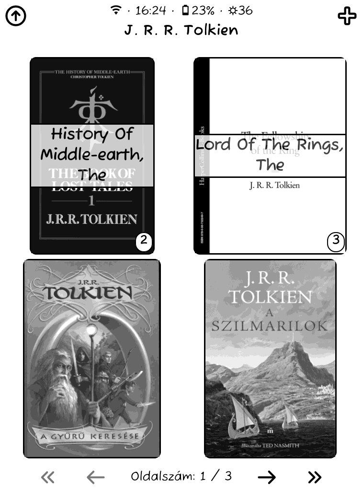
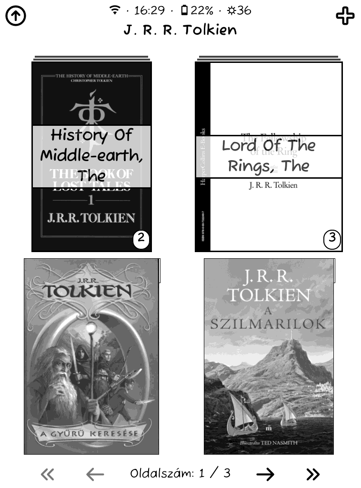

# Plugins and Userpatches
These are the KOReader plugins and userpatches I found on the internet and created or modified.

## Plugins

### [iconschanger.koplugin](https://github.com/ebanDev/iconschanger.koplugin)
- add: Ming Cute iconpack

### [pocketbookcover.koplugin](https://github.com/ckilb/pocketbookcover.koplugin)
- remove: sleepscreen cover

### [provider-webdav-highlights.koplugin](https://github.com/fairlygood/provider-webdav-highlights.koplugin)
- change: filename format for all book export and single book export (All-Books-date.md and Author-Title-date.md)

## Patches

### [2-cover-beautifier](patches/2-cover-beautifier.lua)
Based on [2-browser-folder-cover](https://github.com/sebdelsol/KOReader.patches)
- add: rounded corner option for folders and book covers

  

    
With rounded corners:

    
  

  

    
Without rounded corners:

    
  

### [2-disable-keyboard-hold](patches/2-disable-keyboard-hold.lua)
On my PocketBook Touch Lux 2 (old but does its job 😄) the keyboard was very hard to use. Often it would detect a long press on keys so it opened the popup or deleted whole lines with backspace. This patch disables hold functionality for all the keys except shift so you can still use CapsLock and use swipes for accented characters.

### [2-disable-top-menu-zones](https://github.com/sebdelsol/KOReader.patches)

### [2-exporter-file-format](https://github.com/koreader/koreader/issues/12587#issuecomment-2393154113)
- change: filename format so it's the same as [provider-webdav-highlights.koplugin](https://github.com/fairlygood/provider-webdav-highlights.koplugin)

### [2-browser-hide-underline](https://github.com/sebdelsol/KOReader.patches)

### [2-browser-up-folder](https://github.com/sebdelsol/KOReader.patches)

### [2-filemanager-titlebar](https://github.com/sebdelsol/KOReader.patches)

### [2-large-subtitles](https://github.com/ImSoRight/KOReader.patches)

### [2-menu-size](https://github.com/sebdelsol/KOReader.patches)

### [2-reference-page-count](https://github.com/sebdelsol/KOReader.patches)

### [2-shortcut-subtitles](https://github.com/ImSoRight/KOReader.patches)

### [2-statusbar-better-compact](https://github.com/sebdelsol/KOReader.patches)

### [2-ui-font](https://github.com/sebdelsol/KOReader.patches)

## Attribution
Links are provided for the original works where available.